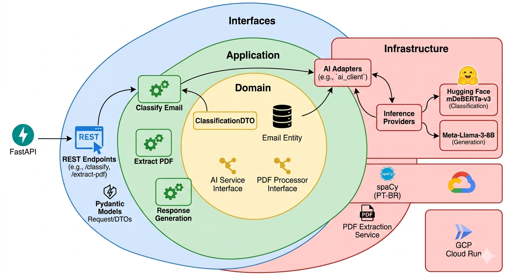

# Auto-U Backend: Inteligência Artificial para Triagem de E-mails

Uma solução desenvolvida para automatizar a classificação e resposta de e-mails em instituições financeiras. O foco principal é separar comunicações **Produtivas** (que exigem ação humana ou sistêmica) de **Improdutivas** (saudações, spans, agradecimentos), utilizando modelos de IA avançados.

## 🧠 Decisões Técnicas & Inteligência Artificial

A escolha dos modelos de IA foi pautada pelo equilíbrio entre precisão semântica em Português e eficiência computacional.

### 1. Classificação: deberta-v3-large-zeroshot-v2.0
O modelo **MoritzLaurer/deberta-v3-large-zeroshot-v2.0** é um classificador de última geração projetado para a tarefa de NLI (Natural Language Inference), otimizado especificamente para classificação de texto sem treinamento prévio **(Zero-Shot)**.
* **Atenção Desmembrada:** Ao contrário do BERT, ele trata o conteúdo e a posição relativa das palavras em vetores separados, o que permite uma compreensão muito mais rica da sintaxe e do contexto em frases complexas.
* **Electra-style Pre-training:** A versão v3 utiliza uma técnica de treinamento onde o modelo precisa detectar tokens substituídos, tornando-o muito mais eficiente em extrair significado de sequências curtas de texto, como e-mails.
* **Multilíngue e Robusto:** Embora o nome indique "large", esta versão v2.0 foi refinada com datasets massivos de NLI, o que o torna excelente para entender português, mesmo tendo sido treinado majoritariamente em inglês.

### 2. Geração: Meta-Llama-3-8B-Instruct
Para a sugestão de resposta, utilizei o **Llama-3-8B** via interface de *Chat Completions*.
* **Prompt Engineering:** Implementei a técnica de *Few-Shot Prompting* no System Prompt para garantir que a IA gere respostas executivas, curtas e profissionais, evitando a prolixidade comum em modelos de larga escala.
* **Segurança:** O modelo foi instruído a nunca solicitar dados sensíveis, mantendo a conformidade com diretrizes bancárias.

---

## 🏗️ Arquitetura do Sistema



O projeto foi construído seguindo os princípios da **Clean Architecture**, garantindo que a lógica de negócio seja independente de ferramentas e provedores externos.

* **Domain:** Contém as entidades e as interfaces (contracts) que definem o comportamento do sistema.
* **Application:** Implementa os casos de uso (Use Cases), orquestrando o fluxo entre a IA e as regras de negócio.
* **Infrastructure:** Implementações concretas de clientes de API (Hugging Face/Novita), serviços de NLP (spaCy) e configurações de ambiente.
* **Interfaces:** Ponto de entrada da aplicação via **FastAPI**, com DTOs validados via Pydantic para garantir o contrato com o Frontend React.

---

## 🛠️ Ferramentas & Tecnologias

| Tecnologia | Finalidade | Motivo |
| :--- | :--- | :--- |
| **Python 3.12** | Linguagem Core | Ecossistema maduro para IA e Processamento de Dados. |
| **FastAPI** | Framework Web | Alta performance e documentação automática com Swagger. |
| **spaCy (PT-BR)** | Pré-processamento | Limpeza de ruído e lematização para reduzir o custo de tokens na API. |
| **Uvicorn** | Servidor | Confiabilidade e baixo overhead para containers. |
| **Makefile** | Automação | Abstração de comandos complexos de build, teste e deploy. |
| **Terraform** | IaC (Infra as Code) | Provisionamento dos recursos de nuvem. |

---

### ☁️ Infraestrutura & Provisionamento

Utilizei **Terraform** para gerenciar a infraestrutura no **Google Cloud Platform (GCP)**, garantindo que o ambiente seja replicável e auditável.
* **Artifact Registry:** Repositório privado para versionamento de imagens Docker.
* **Cloud Run:** Ambiente serverless que escala conforme a demanda, otimizando custos.

### Docker Multi-Stage Build

Desenvolvi um `Dockerfile` otimizado em dois estágios:
1.  **Builder:** Compila as dependências e faz o download dos modelos pesados do spaCy.
2.  **Runner:** Uma imagem final leve (slim), contendo apenas o essencial para a execução, o que reduz drasticamente o tempo de inicialização (Cold Start) em ambientes serverless.

### Estratégia de Cloud (Agnostica)
A aplicação está preparada para rodar em:
* **Google Cloud Run:** Ideal pela simplicidade e escalabilidade baseada em requisições.
* **AWS App Runner:** Para uma integração nativa com o ecossistema AWS e ECR.

### CI/CD com GitHub Actions
Configurei pipelines automatizados que realizam:
* **Testes Automatizados:** Eu garanto a integridade do código rodando `make test` em cada Pull Request.
* **Deploy Contínuo:** O build da imagem e o push para os registros (GCR/ECR) são feitos automaticamente após o merge na branch `main`.

---

## ⚙️ Como Executar

"As credenciais de IA devem ser configuradas no arquivo .env seguindo o modelo disponível em .env.example".

**Pré-requisitos:** Docker e Terraform instalados.

1.  Clone o repositório.
2.  Crie um arquivo `.env` com seu `HUGGINGFACE_TOKEN`.
3.  **Provisionar Infra:**
    ```bash
    cd infra/gcp && terraform init && terraform apply
    ```
4.  **Execução Local:**
    ```bash
    make build-docker
    make up
    ```
5.  **Testes:**
    ```bash
    make test
    ```

---

## 🌐 API Online

A aplicação está disponível publicamente para consumo. 

> **Nota:** Por se tratar de uma infraestrutura *serverless* no Google Cloud Run, as primeiras requisições podem apresentar uma latência maior (**Cold Start**) enquanto o container é inicializado.

### Endpoints Principais

| Nome | Método | URL |
| :--- | :--- | :--- |
| **ClassifyEmail** | `POST` | `https://auto-u-backend-180653172521.southamerica-east1.run.app/classify` |
| **ExtractPDF** | `POST` | `https://auto-u-backend-180653172521.southamerica-east1.run.app/extract-pdf` |

---

## 📖 Documentação Interativa (Swagger)

O backend utiliza as capacidades nativas do **FastAPI** para expor uma documentação completa e interativa dos recursos disponíveis. Nela, é possível visualizar os esquemas de dados (DTOs) validados via **Pydantic** e realizar testes diretamente pelo navegador.

* **URL da Documentação:** [https://auto-u-backend-180653172521.southamerica-east1.run.app/docs](https://auto-u-backend-180653172521.southamerica-east1.run.app/docs)

---

---
*Desenvolvido por Filipe F. Lima - Fullstack Developer*
